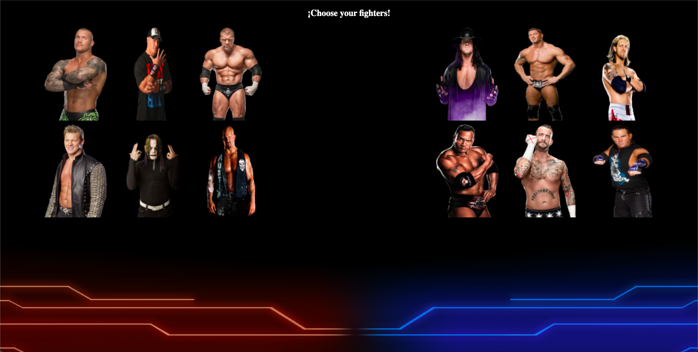

# Third Project at GeeksHubs Bootcamp

# VideoGame

This VideoGame consists of a fighting mechanism where we reproduce a 1vs1 battle in a team of 4. Each time a character is defeated, the next character inline will be spawn to fight and succesively.

The game itself is inspired by the theme of Wrestling. In my childhood I used to watch a show called WWE. This show was broadcasted on the spanish TV then, and many of us were used to watch it just because it was funny and entertaining. 

That is why I tried to recreate the same atmosphere into this game, so you can also enjoy the same and maybe, maybeeee, shead a tear for the nostalgia.

## Fight Game.

I am delighted to show you my very first videogame made with the following programming languages:

 |  | 

# How to play

[Play Game](https://guillermoraez.github.io/Proyecto3-Videojuego/)

First, you will be asked to press the Start Button.

Then, you will proceed by choosing 8 characters from the Roster.

A Loading screen will be shown once the characters selected. Be patient, I know you relly want to play.

Once the Fight screen is on, you will be able to attack characters from both teams. 

Use the keys "left arrow" and "right arrow" from your  to attack.

At the end of the match, you will be redirected to the last Screen, which will show you who won and you will have the option to reset the Game and start playing again.

# Future Updates

1. Adding a reactive canvas healthbar to the fight screen.
2. Add sounds to the character selection.
3. Add a "You win" scene and a "You Lose" scene with funny gifs.
4. Work on the design to polish it.
5. Retouch the game mechanichs to make it more intereactive.

# Special Thanks

I would like to add some kind words to my classroom mates who have helped me with my project.

1. [José Luis Github](https://github.com/ApcarJo) (Thank you for the keyboard events and for the inspiration of some of the fight functions).
2. [Adriana Github](https://github.com/AdrianaFayos) (Thanks for helping me with the audio for the game, which will be added very soon)
3. [Alejandro Github](https://github.com/2020-JAUG)  (Thanks to you too buddy, for the help with the audio and setting it with the addEventListener, needs to be added too.)

And also a big THANK YOU to my other classroom mates for the companionship and the good mood there is, in and out of class.

Hope you like it!

 Git Init ONCE! 